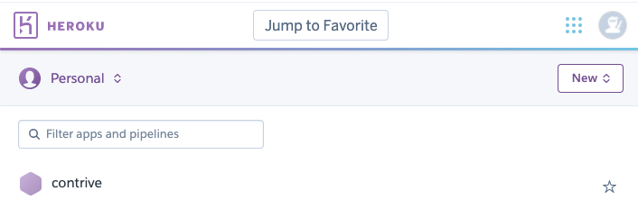

# Heroku

This application has already been deployed to Heroku for Contrive's convenience.  We will need Contrive to share their Heroku account so that we can pass ownership to them.  We have also included the necessary steps to deploy this repository to Heroku (which have already been completed), for Contrive's information.

### Heroku Prerequisite

1. Sign up for an account on [Heroku.com](https://www.heroku.com/)
2. Install Heroku CLI by typing `brew tap heroku/brew && brew install heroku` in your Terminal
  - [Additional installation notes and troubleshooting](https://devcenter.heroku.com/articles/heroku-cli#download-and-install)
3. Authenticate by typing `heroku login` in Terminal (this will open your browser for you to authenticate login)

> Note: Your project will need to have a git repository to deploy to Heroku, which you create when you pull the GitHub repository down to your local machine. [More information on cloning a GitHub repository here] (https://docs.github.com/en/github/creating-cloning-and-archiving-repositories/cloning-a-repository)
**Keep in mind you CAN NOT pull from Heroku. This is not a replacement for GitHub!**

### Heroku Setup
#### (These steps have already been completed for Contrive's convenience.)

Before you deploy, verify that your `PORT` in your server.js file is configured correctly as:

```JavaScript
const PORT = process.env.PORT || 5000;
```

In order to control the name of your Heroku application in as few steps as possible, We recommend creating a Heroku App first, then integrate it with your git project, but you can also do this in reverse order.  We have written our recommendation, but you can find alternative solutions [here] (https://devcenter.heroku.com/articles/git#creating-a-heroku-remote). 

1. Login to your Heroku account, and select the "New" dropdown + "Create new app" in the top right corner. 
2. In your local terminal, navigate to your project folder and execute command `heroku create`.
3. Type `git remote -v` to ensure it added successfully
4. In terminal, type `git push heroku master`
5. Your website is now live! However... we also need to set up the database

### Postgresql on Heroku
#### (These steps have already been completed for Contrive's convenience.)

1. In terminal, type `heroku addons:create heroku-postgresql:hobby-dev` to set up Postgresql on your Heroku project
2. Next, type `heroku pg:push contrive_db DATABASE_URL` to copy your database contents up to Heroku. `contrive_db` is the actual name of your database. `DATABASE_URL` is a heroku config variable created by the Add On. Do not replace it with something else, just type: `DATABASE_URL`. 

> Note: You'll need to commit and push each time you make a change that you want to deploy to Heroku. Automatic deployments are covered in [a later section](#gui-and-automatic-deployment) 

```
git add .
git commit -m "MESSAGE"
git push heroku master
```

Lastly, open terminal and type `heroku open`, which should show you your deployed site!

> Note: It is best to fully test your code locally before deploying to Heroku. Bugs are much harder to troubleshoot on a live website.

### Miscellaneous

- `heroku logs` - Display error logs
- `heroku config` - Show basic app info
- `heroku restart` - Sometimes it helps to turn things off an on again
- `heroku open` - Opens the website for your project in the browser

## GUI and Automatic Deployment

The [Heroku](https://www.heroku.com/) website GUI can simplify several of the steps taken above especially for projects where you intend to make future changes.

1. In [your list of Heroku apps](https://dashboard.heroku.com/apps), select your application.
2. Under the `Deploy` tab, in the `Deployment Method` section, select `Github`. Connect to the `Github` repository with your application by searching for the name of your repository.
3. In the `Manual Deploy` section, click `Deploy Branch` to deploy for the first time.

## Connect Postico to your Heroku Database

If you would like to edit your database, you can connect to your Heroku database directly from Postico. 

1. In [your list of Heroku apps](https://dashboard.heroku.com/apps), select your application.
2. Under `Resources` or in the `Configure Add-Ons` section, select `Heroku Postgres`.
3. Select the `Settings` tab and click `View Credentials`
4. Open Postico and select `New Favorite`.
5. In the new Postico favorite, update the following to match Heroku:
  - Host
  - User
  - Database
  - Password
  - Port
6. Click `Connect` and you should have access to your database directly from Postico!

## Resources

More detailed instructions can be found here: 

- Deployment Videos [https://drive.google.com/drive/u/1/folders/0B9sCDSmGi72ZN2hpR1Etbl9qb2c](https://drive.google.com/drive/u/1/folders/0B9sCDSmGi72ZN2hpR1Etbl9qb2c)
- [https://devcenter.heroku.com/articles/git](https://devcenter.heroku.com/articles/git)
- [https://devcenter.heroku.com/articles/heroku-postgresql](https://devcenter.heroku.com/articles/heroku-postgresql)
