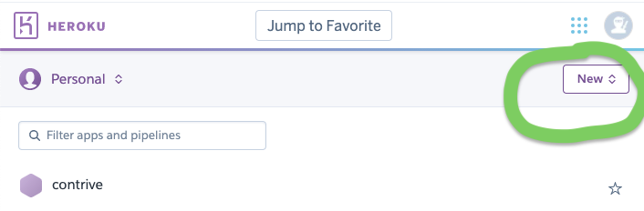
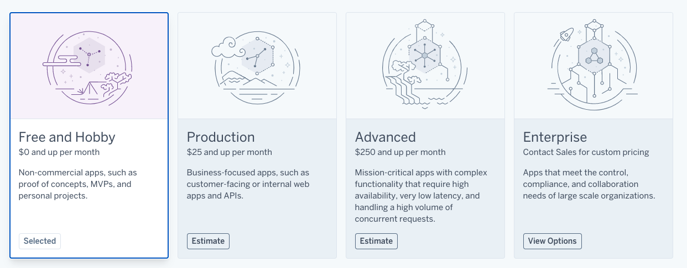

# Heroku

This application has already been deployed to Heroku for Contrive's convenience, and can be seen at [https://contrive.herokuapp.com/](https://contrive.herokuapp.com/).  We will need Contrive to share their Heroku account so that we can pass ownership to them.  We have also included the necessary steps to deploy this repository to Heroku (which have already been completed), for Contrive's information.

Contrive's first actions for this handoff:
1. Create a Heroku account (see Heroku Prerequisite below).
2. Share the email address of your account with the Cullen-Contrive team.
3. Accept the transfer of the application (see Heroku Transfer below)


### Heroku Prerequisite

1. Sign up for an account on [Heroku.com](https://www.heroku.com/)
2. Install Heroku CLI by typing `brew tap heroku/brew && brew install heroku` in your Terminal
  - [Additional installation notes and troubleshooting](https://devcenter.heroku.com/articles/heroku-cli#download-and-install)
3. Authenticate by typing `heroku login` in Terminal (this will open your browser for you to authenticate login)

> Note: Your project will need to have a git repository to deploy to Heroku, which you create when you pull the Contrive GitHub repository down to your local machine. [More information on cloning a GitHub repository here] (https://docs.github.com/en/github/creating-cloning-and-archiving-repositories/cloning-a-repository)
**Keep in mind you CAN NOT pull from Heroku. This is not a replacement for GitHub!**


### Heroku Setup
#### (These steps have already been completed for Contrive's convenience.)

Before you deploy, verify that your `PORT` in your server.js file is configured correctly as:

```JavaScript
const PORT = process.env.PORT || 5000;
```

In order to control the name of your Heroku application in as few steps as possible, we recommend creating a Heroku App first, then integrate it with your git project, but you can also do this in reverse order.  We have written our recommendation, but you can find alternative solutions [here] (https://devcenter.heroku.com/articles/git#creating-a-heroku-remote). 

1. Login to your Heroku account, and select the "New" dropdown + "Create new app" in the top right corner. 
2. Choose a unique application name, and select "create app".
3. In your local repository's terminal (in your code editor with the repo open) run command `heroku git:remote -a YOUR-REPO-NAME-HERE`, so for example we ran `heroku git:remote -a contrive` in our VS Code to link our local repo to the contrive Heroku app.
4. Type `git remote -v` to ensure it added successfully
5. In terminal, type `git push heroku master` to send this repository to be the Heroku app.
6. Your website is now live! However... we also need to set up the database


### Postgresql on Heroku
#### (These steps have already been completed for Contrive's convenience.)

1. In terminal, type `heroku addons:create heroku-postgresql:hobby-dev` to set up Postgresql on your Heroku project
2. Next, type `heroku pg:push contrive_db DATABASE_URL` to copy your database contents up to Heroku. `contrive_db` is the actual name of your database. `DATABASE_URL` is a heroku config variable created by the Add On. Do not replace it with something else, just type: `DATABASE_URL`. 

Lastly, open terminal and type `heroku open`, which should show you your deployed site!

> Note: It is best to fully test your code locally before deploying to Heroku. Bugs are much harder to troubleshoot on a live website.


### Heroku Transfer

The Cullen-Contrive team will be transferring the deployed contrive app to you by following the instructions found [here](https://devcenter.heroku.com/articles/transferring-apps).  The most important thing we need from Contrive is to accept the transfer once it is initiated:

Note: the contrive app is currently in a free mode on Heroku, so no bills will be transferred to you.


### Miscellaneous

- `heroku logs` - Display error logs
- `heroku config` - Show basic app info
- `heroku restart` - Sometimes it helps to turn things off and on again
- `heroku open` - Opens the website for your project in the browser


## Manually Deploying Updates

- You will need to commit and push each time you make a change that you want to deploy to Heroku. Automatic deployments are covered in [a later section](#gui-and-automatic-deployment) 

- Each time you are ready to deploy a change, run the following commands in your repo terminal:

```
git add .
git commit -m "MESSAGE"
git push heroku master
```


## GUI and Automatic Deployment

The [Heroku](https://www.heroku.com/) website GUI can simplify several of the steps taken above especially for projects where you intend to make future changes.

1. In [your list of Heroku apps](https://dashboard.heroku.com/apps), select your application.
2. Under the `Deploy` tab, in the `Deployment Method` section, select `Github`. Connect to the `Github` repository with your application by searching for the name of your repository.
3. In the `Manual Deploy` section, click `Deploy Branch` to deploy for the first time.


## Pricing
- [Full Heroku pricing details](https://www.heroku.com/pricing)



The Contrive Heroku is currently set up under the "Hobby-Dev" setting, which is free of charge.  This setting offers full functionality, but often takes 30 seconds to load when the app is opened, and limits database storage to 10,000 rows.

If you want your app to not take 30 seconds to spin up the first time someone goes to it, you will need to pay $7/month for a heroku dyno.

If you want your app to hold 10,000 users (which might translate to a million rows of total SQL information) then you will need to pay $9/month for a million database rows.

## Resources

More detailed instructions can be found here: 

- [https://devcenter.heroku.com/articles/git](https://devcenter.heroku.com/articles/git)
- [https://devcenter.heroku.com/articles/heroku-postgresql](https://devcenter.heroku.com/articles/heroku-postgresql)
