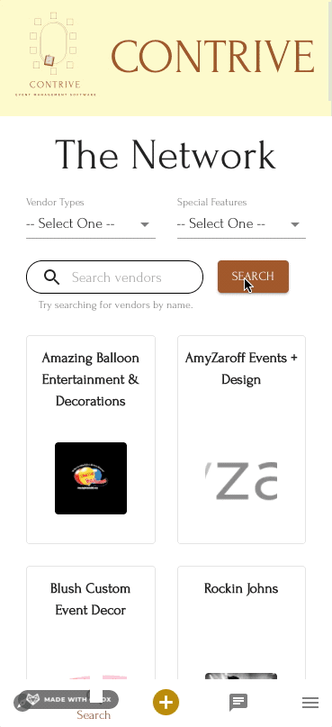

# Contrive Application

## Description

_Duration: 2 Week Sprint_

Contrive is an event management software platform that connects Event Planners with their local Vendors. With enhanced search features, Planners can find the types of Vendors they most want to do business with and can easily connect with them utilizing the messaging feature.

To see the fully functional site, please visit: [DEPLOYED VERSION OF APP](https://contrive.herokuapp.com/)

## Screen Shots

### Landing Page & The Network

Contrive features a unique login page for users to login to there accounts from. **The Network** is Contrive's search feature that gives the ability for users to search both by vendor type, special features vendors advertise, and name information.

 

### Contrive's Messaging Feature

Contrive creates the ability for planners and vendors to communicate with each other and store those conversations in an easy to read space.

 

## Prerequisites

Before you get started, make sure you have the following software installed on your computer:

- [Express](https://expressjs.com/)
- [Node.js](https://nodejs.org/en/)
- [Postico](https://eggerapps.at/postico/)
- [PostrgeSQL](https://www.postgresql.org/)

### Application Database:

Create a new postgreSQL database named `contrive_db` and copy all text in the `database.sql` file saved in the root folder of this repository. Paste all the copied text as a SQL query ([Postico](https://eggerapps.at/postico/) was used for original database creation) and execute the queries sequentially (Note: DROP TABLE queries at the top of the document will not do anything on initial setup since there are no tables yet created, and these DROP TABLE queries should be used carefully, as they permanently delete tables and any stored data therein.) To load sample data, copy all text in the `dummyData.sql` file saved in the root folder and paste the copied text as a SQL query. Execute the queries sequentially to load the sample data.

## Setting up AWS S3 Bucket

Refer to [AWSSetUp](./AWSSetUp.md) documentation on how to get started with an AWS S3 Bucket.

## Development Setup Instructions

1. Fork and Clone this repo and open it inside your code editor of choice.
2. Create a database named `contrive_db` (see [Application Database](https://github.com/Cullen-Contrive/Contrive#application-database)).

3. The project is built on [Postgres](https://www.postgresql.org/download/), so you will need to make sure to have that installed. We recommend using [Postico](https://eggerapps.at/postico/) to run the queries as that was used to create the queries.

   1. The queries in the `database.sql` file are set up to create all the necessary tables (see [Application Database](https://github.com/Cullen-Contrive/Contrive#application-database)).

   2. The queries in the `dummyData.sql` file are set up to populate the needed data to allow the application to run correctly (see [Application Database](https://github.com/Cullen-Contrive/Contrive#application-database)).

4. Create a `.env` file in the root directory and edit it as follows:

   1. Paste this line into the file:

   ```javascript
   SERVER_SESSION_SECRET = superDuperSecret;
   ```

   While you're in your new `.env` file, take the time to replace `superDuperSecret` with some long random string like `25POUbVtx6RKVNWszd9ERB9Bb6` to keep your application secure. Here's a site that can help you: [Secure Password Generator](https://passwordsgenerator.net/). If you don't do this step, create a secret with less than eight characters, or leave it as `superDuperSecret`, you will get a warning.

   2. Paste the following lines into the file for db setup and deployment options:

   ```javascript
   PGDATABASE = contrive_db;
   PGPORT = 5432;
   ```

   3. Paste the following lines into the file for AWS setup:

   ```javascript
   AWS_ACCESS_KEY_ID = xx;
   AWS_SECRET_ACCESS_KEY = xx;
   REACT_APP_S3_URL = xx;
   AWS_S3_BUCKET = xx;
   AWS_S3_REGION = xx;
   ```

   You will need to enter your own values for `xx` after the `=` sign for each key value pair. Refer to step 7 in [AWSSetUp](./AWSSetUp.md).

5. Start PostgreSQL if not already running by using the `brew services start postgresql` command in your terminal.
6. Open up your editor of choice and run an `npm install`.
7. Run `npm run server` in your terminal.
8. Run `npm run client` in your terminal.
9. The `npm run client` command will open up a new browser tab for you!

   1. If a new browser doesn't open, navigate to `localhost:3000` in the browser.

## Lay of the Land

Directory Structure:

- `src/` contains the React application
- `public/` contains static assets for the client-side
- `build/` contains the transpiled code from `src/` and `public/` that will be viewed on the production site (Heroku)
- `server/` contains the Express App

This code is commented in each individual file with the aim to make it accessible.

## Usage

1. New Users can **REGISTER** as either a Planner or a Vendor from the _Welcome_ page.

   1. _Planners_ have one registration page.

   2. _Vendors_ have two registration pages.

2. Existing users can **LOGIN** with their credentials from the _Welcome_ page.
3. Once logged in, the navigation bar along the bottom of the screen allows travel through the site.

   1. **Discover** (compass icon) takes the user to the _Discover Contrive_ page where they can learn about current events and how to use the site.
      **NOTE:** currently a static page, waiting for future enhancements.

   2. **Search** (magnifying glass icon) takes the user to _The Network_ page where they can search for vendors.

      1. All vendors on the app are listed when no search criteria is entered. By using the drop downs and search bar, the list of vendors can be refined and filtered.

      2. Profile information about a vendor can be found by clicking on their respective card in the search results.
         **NOTE:** This link is only available to _Planners_ and _Admin_ roles.

   3. **Plan** (plus icon) takes the user to the _Create Event_ page where they can create a new event.
      **NOTE:** This link is only available to _Planners_ and _Admin_ roles.

   4. **Messages** (chat icon) takes the user to the _Messages_ page where they can view a list of all their message threads

      1. Clicking on any thread will show the details of the thread and allow the new messages in the thread to be created.

   5. **Menu** (hamburger icon) opens the side navigation drawer. The user's name and profile picture will be displayed at the top of the drawer along with the following links:

      1. **My Profile** allows the users to view, and edit, their profile.
         **NOTE:** this link currently only shows for _Vendors_ and needs to be implemented for all other user types.

      2. **My Network** allows the user to see all other users they have chosen to be apart of their network.
         **NOTE:** currently a placeholder for future features.

      3. **My Events** list view of all of the users' events.
         **NOTE:** currently a placeholder for future features.

      4. **My Calendar** calendar view of all of the users' events.
         **NOTE:** currently a placeholder for future features.

      5. **Inspiration** allows a _Planner_ to get ideas for their event (think Pinterest)
         **NOTE:** currently a placeholder for future features.

      6. **Admin Portal** takes the _Admin_ to the _Admin Portal_ page where they can remove users from the system.

      7. **LOG OUT** logs the user out of the app and redirects them to the _Welcome_ page.

4. _Profile Page_ shows the information the user entered when registering for the app.

   1. An action bar is displayed that will link to email, messages (in app feature), phone, location, and website if the information was provided by the user during registration.

   2. _Vendors_ can see their ratings score (future enhancement).

   3. If a user navigates to their own profile page, they will have the option to edit the page.

5. To become an admin (at current time), register as a _Planner_ and manually change the `type` value from `planner` to `admin` in the "users" table in the db.

## Authors

- [Dusty Meyers](https://dustymeyers.com)
- [Jason Lin](https://github.com/jasonwl1995)
- [John Shands](https://www.johnshands.com/)
- [McKynlee Westman](https://mckynlee.github.io/about/)
- [William Krug](https://william-krug-portfolio.herokuapp.com/#/home)

## Built with:

- [AWS](https://aws.amazon.com/)
- [CSS](https://developer.mozilla.org/en-US/docs/Web/CSS)
- [Express](https://expressjs.com/)
- [HTML](https://developer.mozilla.org/en-US/docs/Web/HTML)
- [JavaScript](https://developer.mozilla.org/en-US/docs/Web/JavaScript)
- [Material-UI](https://material-ui.com/)
- [Node.js](https://nodejs.org/en/)
- [Nodemon](https://nodemon.io/)
- [Passport](http://www.passportjs.org/)
- [Postico](https://eggerapps.at/postico/)
- [PostrgeSQL](https://www.postgresql.org/)
- [React](https://reactjs.org/)
- [Redux](https://redux.js.org/)
- [Redux-Sagas](https://redux-saga.js.org/)
- [Socket.io](https://socket.io/)
- [SweetAlert2](https://sweetalert2.github.io/)

A full list of dependencies can be found in the `package.json` file in the root directory.

## Known Bugs:

- **Vendor Registration**, if their username is already taken, they are not routed back to the first registration page.
- **Login**, if user inputs wrong password, footer appears in the password field.
- **Create Event**, Date picker has a rendering bug. Label appears in the input field.
- **My Events**, events are not able to delete. No backend route setup.
- **Edit Vendor**, any logged in user can route to an Edit Vendor page if they know the url.
- **All Messages**, all messages ordered backwards by date. Preview message for each conversation is also the first message sent in the conversations.
- **My Calendar & My Network**, currently route to 404.

## License

[MIT](https://choosealicense.com/licenses/mit/)

Copyright (c) 2021 Aretha McDonald & Alexandria Watkins

Permission is hereby granted, free of charge, to any person obtaining a copy
of this software and associated documentation files (the "Software"), to deal
in the Software without restriction, including without limitation the rights
to use, copy, modify, merge, publish, distribute, sublicense, and/or sell
copies of the Software, and to permit persons to whom the Software is
furnished to do so, subject to the following conditions:

The above copyright notice and this permission notice shall be included in all
copies or substantial portions of the Software.

THE SOFTWARE IS PROVIDED "AS IS", WITHOUT WARRANTY OF ANY KIND, EXPRESS OR
IMPLIED, INCLUDING BUT NOT LIMITED TO THE WARRANTIES OF MERCHANTABILITY,
FITNESS FOR A PARTICULAR PURPOSE AND NONINFRINGEMENT. IN NO EVENT SHALL THE
AUTHORS OR COPYRIGHT HOLDERS BE LIABLE FOR ANY CLAIM, DAMAGES OR OTHER
LIABILITY, WHETHER IN AN ACTION OF CONTRACT, TORT OR OTHERWISE, ARISING FROM,
OUT OF OR IN CONNECTION WITH THE SOFTWARE OR THE USE OR OTHER DEALINGS IN THE
SOFTWARE.

## Acknowledgement

Thanks to Aretha McDonald and Alexandria Watkins for giving use the opportunity to develop this prototype for them. Thank you [Prime Digital Academy](https://www.primeacademy.io/) who equipped us with the skills to make this application a reality. The Cullen cohort for always having our backs and helping us every step of the way and Team Contrive for building one killer app.
